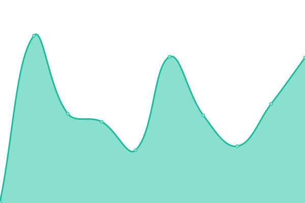
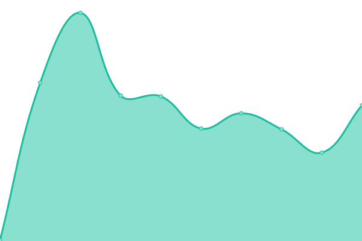
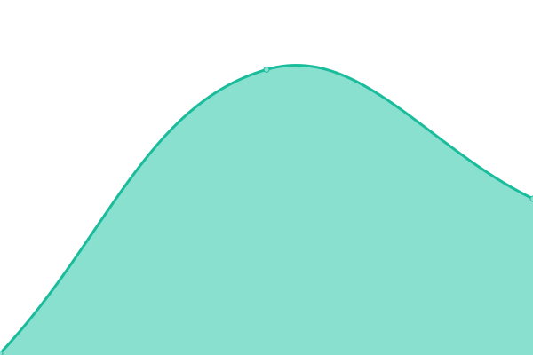
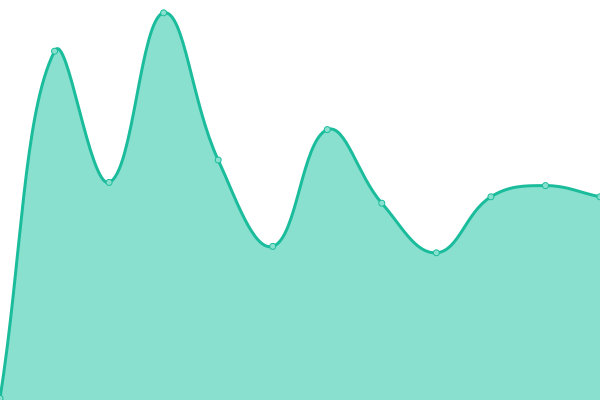

# [📈 Live Status](https://status.carbonnapkin.com): <!--live status--> **🟧 Partial outage**

This repository contains the open-source uptime monitor and status page for [CarbonNapkin](https://status.carbonnapkin.com), powered by [Upptime](https://github.com/upptime/upptime).

With [Upptime](https://upptime.js.org), you can get your own unlimited and free uptime monitor and status page, powered entirely by a GitHub repository. We use [Issues](https://github.com/CarbonNapkin/upptime/issues) as incident reports, [Actions](https://github.com/CarbonNapkin/upptime/actions) as uptime monitors, and [Pages](https://status.carbonnapkin.com) for the status page.

<!--start: status pages-->
<!-- This summary is generated by Upptime (https://github.com/upptime/upptime) -->
<!-- Do not edit this manually, your changes will be overwritten -->
<!-- prettier-ignore -->
| URL | Status | History | Response Time | Uptime |
| --- | ------ | ------- | ------------- | ------ |
|  [API](https://api.carbonnapkin.com/health) | 🟥 Down | [api.yml](https://github.com/CarbonNapkin/upptime/commits/HEAD/history/api.yml) | 

 130ms
     
 | 

<a href="https://status.carbonnapkin.com/history/api">100.00%</a>
    

|  [Portal](https://portal.carbonnapkin.com/health) | 🟥 Down | [portal.yml](https://github.com/CarbonNapkin/upptime/commits/HEAD/history/portal.yml) | 

 127ms
     
 | 

<a href="https://status.carbonnapkin.com/history/portal">100.00%</a>
    

|  [C6NAP](https://c6nap.com/health) | 🟩 Up | [c6-nap.yml](https://github.com/CarbonNapkin/upptime/commits/HEAD/history/c6-nap.yml) | 

 151ms
     
 | 

<a href="https://status.carbonnapkin.com/history/c6-nap">100.00%</a>
    

|  [CarbonNapkin](https://carbonnapkin.com/health) | 🟥 Down | [carbon-napkin.yml](https://github.com/CarbonNapkin/upptime/commits/HEAD/history/carbon-napkin.yml) | 

 120ms
     
 | 

<a href="https://status.carbonnapkin.com/history/carbon-napkin">100.00%</a>
    

|  [Great Lakes Shafts](https://greatlakesshafts.com/health) | 🟥 Down | [great-lakes-shafts.yml](https://github.com/CarbonNapkin/upptime/commits/HEAD/history/great-lakes-shafts.yml) | 

 143ms
     
 | 

<a href="https://status.carbonnapkin.com/history/great-lakes-shafts">100.00%</a>
    

|  [Lake Superior Fasteners](https://lakesuperiorfasteners.com/health) | 🟥 Down | [lake-superior-fasteners.yml](https://github.com/CarbonNapkin/upptime/commits/HEAD/history/lake-superior-fasteners.yml) | 

 121ms
     
 | 

<a href="https://status.carbonnapkin.com/history/lake-superior-fasteners">100.00%</a>
    

<!--end: status pages-->

[**Visit our status website →**](https://status.carbonnapkin.com)

## 📄 License

- Powered by: [Upptime](https://github.com/upptime/upptime)
- Code: [MIT](./LICENSE) © [Anand Chowdhary](https://anandchowdhary.com), supported by [Pabio](https://pabio.com)
- Data in the `./history` directory: [Open Database License](https://opendatacommons.org/licenses/odbl/1-0/)
