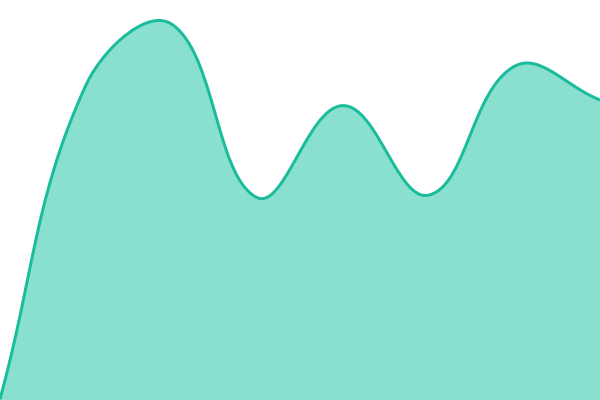
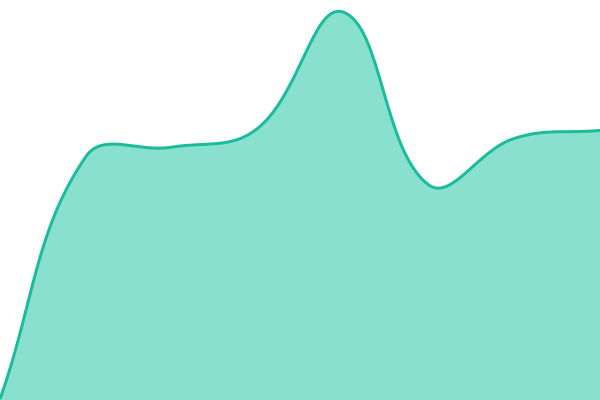
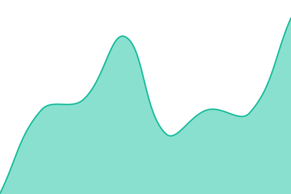
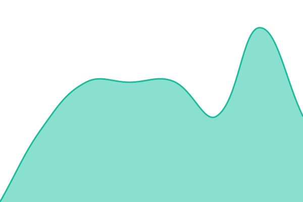
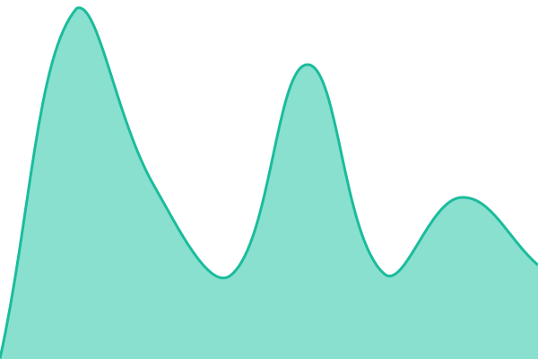
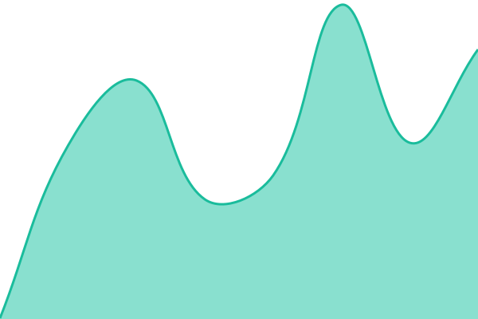

# [📈 Live Status](https://status.carbonnapkin.com): <!--live status--> **🟩 All systems operational**

This repository contains the open-source uptime monitor and status page for [CarbonNapkin](https://status.carbonnapkin.com), powered by [Upptime](https://github.com/upptime/upptime).

With [Upptime](https://upptime.js.org), you can get your own unlimited and free uptime monitor and status page, powered entirely by a GitHub repository. We use [Issues](https://github.com/CarbonNapkin/upptime/issues) as incident reports, [Actions](https://github.com/CarbonNapkin/upptime/actions) as uptime monitors, and [Pages](https://status.carbonnapkin.com) for the status page.

<!--start: status pages-->
<!-- This summary is generated by Upptime (https://github.com/upptime/upptime) -->
<!-- Do not edit this manually, your changes will be overwritten -->
<!-- prettier-ignore -->
| URL | Status | History | Response Time | Uptime |
| --- | ------ | ------- | ------------- | ------ |
|  [API](https://api.carbonnapkin.com/health) | 🟩 Up | [api.yml](https://github.com/CarbonNapkin/upptime/commits/HEAD/history/api.yml) | 

 293ms
     
 | 

<a href="https://status.carbonnapkin.com/history/api">100.00%</a>
    

|  [Portal](https://portal.carbonnapkin.com/health) | 🟩 Up | [portal.yml](https://github.com/CarbonNapkin/upptime/commits/HEAD/history/portal.yml) | 

 106ms
     
 | 

<a href="https://status.carbonnapkin.com/history/portal">100.00%</a>
    

|  [CarbonNapkin](https://carbonnapkin.com/health) | 🟩 Up | [carbon-napkin.yml](https://github.com/CarbonNapkin/upptime/commits/HEAD/history/carbon-napkin.yml) | 

 113ms
     
 | 

<a href="https://status.carbonnapkin.com/history/carbon-napkin">100.00%</a>
    

|  [Great Lakes Shafts](https://greatlakesshafts.com/health) | 🟩 Up | [great-lakes-shafts.yml](https://github.com/CarbonNapkin/upptime/commits/HEAD/history/great-lakes-shafts.yml) | 

 111ms
     
 | 

<a href="https://status.carbonnapkin.com/history/great-lakes-shafts">100.00%</a>
    

|  [Database](https://api.carbonnapkin.com/health/db) | 🟩 Up | [database.yml](https://github.com/CarbonNapkin/upptime/commits/HEAD/history/database.yml) | 

 239ms
     
 | 

<a href="https://status.carbonnapkin.com/history/database">100.00%</a>
    

|  [Payments](https://api.carbonnapkin.com/health/payments) | 🟩 Up | [payments.yml](https://github.com/CarbonNapkin/upptime/commits/HEAD/history/payments.yml) | 

 509ms
     
 | 

<a href="https://status.carbonnapkin.com/history/payments">100.00%</a>
    

|  [Droplet](https://api.carbonnapkin.com/health/droplet) | 🟩 Up | [droplet.yml](https://github.com/CarbonNapkin/upptime/commits/HEAD/history/droplet.yml) | 

 1122ms
     
 | 

<a href="https://status.carbonnapkin.com/history/droplet">100.00%</a>
    

|  [FedEx](https://api.carbonnapkin.com/health/fedex) | 🟩 Up | [fed-ex.yml](https://github.com/CarbonNapkin/upptime/commits/HEAD/history/fed-ex.yml) | 

 694ms
     
 | 

<a href="https://status.carbonnapkin.com/history/fed-ex">100.00%</a>
    

|  [UPS](https://api.carbonnapkin.com/health/ups) | 🟩 Up | [ups.yml](https://github.com/CarbonNapkin/upptime/commits/HEAD/history/ups.yml) | 

 299ms
     
 | 

<a href="https://status.carbonnapkin.com/history/ups">100.00%</a>
    

|  [Email](https://api.carbonnapkin.com/health/email) | 🟩 Up | [email.yml](https://github.com/CarbonNapkin/upptime/commits/HEAD/history/email.yml) | 

 276ms
     
 | 

<a href="https://status.carbonnapkin.com/history/email">100.00%</a>
    

|  [HubSpot](https://api.carbonnapkin.com/health/hubspot) | 🟩 Up | [hub-spot.yml](https://github.com/CarbonNapkin/upptime/commits/HEAD/history/hub-spot.yml) | 

 444ms
     
 | 

<a href="https://status.carbonnapkin.com/history/hub-spot">100.00%</a>
    

|  [Crons](https://api.carbonnapkin.com/health/crons) | 🟩 Up | [crons.yml](https://github.com/CarbonNapkin/upptime/commits/HEAD/history/crons.yml) | 

 203ms
     
 | 

<a href="https://status.carbonnapkin.com/history/crons">100.00%</a>
    

|  [Render](https://api.carbonnapkin.com/health/render) | 🟩 Up | [render.yml](https://github.com/CarbonNapkin/upptime/commits/HEAD/history/render.yml) | 

 127ms
     
 | 

<a href="https://status.carbonnapkin.com/history/render">100.00%</a>
    

<!--end: status pages-->

[**Visit our status website →**](https://status.carbonnapkin.com)

## 📄 License

- Powered by: [Upptime](https://github.com/upptime/upptime)
- Code: [MIT](./LICENSE) © [Anand Chowdhary](https://anandchowdhary.com), supported by [Pabio](https://pabio.com)
- Data in the `./history` directory: [Open Database License](https://opendatacommons.org/licenses/odbl/1-0/)
